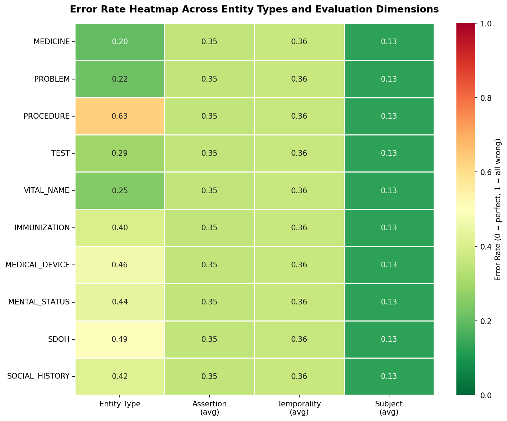
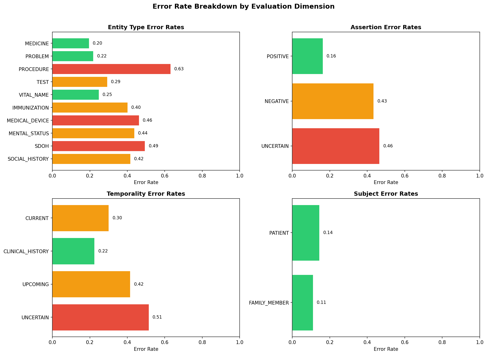
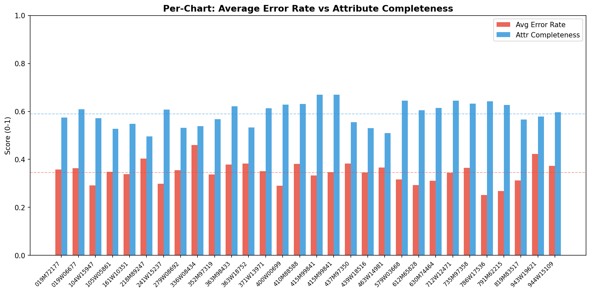

# Clinical NLP Entity Extraction - Evaluation Report

**Author:** Pratham Singla, IIT Roorkee

---

## 1. Executive Summary

This report presents an evaluation of a clinical NLP pipeline that extracts structured medical entities from OCR-processed medical charts. The evaluation was conducted across **30 patient charts** containing a total of approximately **16,500 entities**.

Each entity was scored across **6 dimensions** — entity type classification, assertion detection, temporality reasoning, subject attribution, event date accuracy, and attribute completeness.

| Metric | Value |
|--------|-------|
| Charts evaluated | 30 |
| Overall average error rate | 0.35 |
| Event date accuracy | 0.19 |
| Attribute completeness | 0.59 |

The pipeline performs well on subject attribution (PATIENT vs FAMILY_MEMBER) and assertion detection for confirmed findings. However, it struggles significantly with PROCEDURE entity classification, negation handling, and temporal reasoning for uncertain or future events.

---

## 2. Methodology

The evaluation uses a **two-pillar scoring framework** that combines deterministic rule-based analysis with LLM-based clinical judgment.

### Pillar 1 - Objective Scoring (Weight: 40%)

Rule-based heuristics that run on every entity. These are fast, reproducible, and catch systematic patterns:

- **Entity Type Validation:** Cross-references entity text against medical terminology databases — INN drug naming stems (e.g., -olol for beta-blockers, -statin for statins, -prazole for PPIs), disease suffixes (-itis, -osis, -oma), procedure suffixes (-ectomy, -scopy, -plasty), and curated lists of 300+ known clinical terms. Also validates entity type against the section heading context (e.g., entities under "Medications" should be MEDICINE, not PROBLEM).

- **Assertion Detection (NegEx):** Implements the NegEx algorithm adapted for clinical text. Scans an 80-character window around each entity for pre-negation triggers ("no", "denies", "without", "negative for", "ruled out" — 35+ triggers), post-negation triggers ("unlikely", "was ruled out", "not found" — 15+ triggers), and uncertainty markers ("possible", "suspect", "may", "consider" — 30+ triggers). Includes scope termination handling ("but", "however", "although") and pseudo-negation filtering ("gram negative", "no change") to reduce false positives.

- **Temporality Inference:** Three-signal approach combining heading mappings ("Past Medical History" implies CLINICAL_HISTORY, "Active Problems" implies CURRENT, "Discharge Plan" implies UPCOMING), text-level keyword triggers ("history of", "currently", "scheduled for"), and date-based reasoning (comparing entity dates in metadata against the encounter date). Special handling for chronic conditions that are legitimately both historical and current.

- **Subject Attribution:** Heading-based detection (entities under "Family History" should be FAMILY_MEMBER) combined with text proximity analysis — scanning 120 characters around the entity for family member mentions ("mother", "father", "maternal", "paternal"). Filters out social context false positives like "lives with mother".

- **Event Date Validation:** Checks date format validity, cross-references extracted dates against dates found in the source text, validates plausibility (no future dates for historical events), and checks consistency with the assigned temporality.

- **Attribute Completeness:** Evaluates whether expected metadata is present for each entity type. MEDICINE entities should have STRENGTH and FREQUENCY; TEST entities should have TEST_VALUE; VITAL_NAME entities should have VITAL_NAME_VALUE. Uses a weighted scoring system (critical attributes weighted 1.0, important 0.75, optional 0.5).

### Pillar 2 - Subjective Scoring (Weight: 60%)

LLM-as-judge evaluation using GPT-4o-mini via OpenRouter, applied only to entities where the objective scorer was ambiguous (score between 2.0 and 4.5). This avoids wasting API calls on entities that are clearly correct or clearly wrong.

- **Logprobs-based scoring:** Instead of parsing a single generated token, we request the probability distribution over score tokens 1-5 via `logprobs`. The final score is the expected value: `sum(score * normalized_probability)`. This produces a continuous, more deterministic score rather than a discrete one.

- **Deterministic settings:** `temperature=0`, `seed=42+pass_number`, `max_tokens=1`, `top_logprobs=5`.

- **pass@3 with early stopping:** Each entity-dimension pair is evaluated 3 times (with varying seeds) and the scores are averaged. If the first pass shows >90% confidence (top logprob > -0.1), the remaining passes are skipped to save cost.

- **Few-shot prompting:** Each of the 4 LLM-evaluated dimensions (entity_type, assertion, temporality, subject) has a dedicated system prompt with scoring rubric and 2-3 worked examples showing correct scoring for common error patterns.

### Score Combination

Both pillars produce scores on a 1-5 scale. These are combined using a **weighted geometric mean**:

```
combined = (objective^0.4 * subjective^0.6)
```

The geometric mean penalizes disagreement between pillars — if one pillar scores an entity as 1 (definitely wrong) but the other scores it as 5, the combined score is pulled down more aggressively than with an arithmetic mean. This gives both pillars effective "veto power" over incorrect classifications.

The combined 1-5 score is then converted to a 0-1 error rate: `error_rate = 1 - (score - 1) / 4`.

---

## 3. Error Heatmap

The heatmap below shows error rates across all entity types and evaluation dimensions. Darker red indicates higher error rates; green indicates reliable performance.



Key observations from the heatmap:
- **PROCEDURE** stands out as the worst-performing entity type (0.63 error rate), driven by EMR UI noise being misclassified as clinical procedures.
- **Subject attribution** is consistently strong across all entity types (~0.13 average), indicating the pipeline handles patient vs family member distinction well.
- Entity types like MEDICINE (0.20) and PROBLEM (0.22) show acceptable performance, while SDOH (0.49), MEDICAL_DEVICE (0.46), and MENTAL_STATUS (0.44) are poorly served by the extraction model.

---

## 4. Detailed Error Rates



### Entity Type Classification

| Entity Type | Error Rate | Assessment |
|---|---|---|
| MEDICINE | 0.1954 | Fair |
| PROBLEM | 0.2183 | Fair |
| PROCEDURE | 0.6308 | Critical |
| TEST | 0.2924 | Fair |
| VITAL_NAME | 0.2475 | Fair |
| IMMUNIZATION | 0.4012 | Poor |
| MEDICAL_DEVICE | 0.4619 | Poor |
| MENTAL_STATUS | 0.4372 | Poor |
| SDOH | 0.4938 | Poor |
| SOCIAL_HISTORY | 0.4159 | Poor |

### Assertion Classification

| Assertion | Error Rate | Assessment |
|---|---|---|
| POSITIVE | 0.1629 | Good |
| NEGATIVE | 0.4338 | Poor |
| UNCERTAIN | 0.4647 | Poor |

### Temporality Classification

| Temporality | Error Rate | Assessment |
|---|---|---|
| CURRENT | 0.3008 | Fair |
| CLINICAL_HISTORY | 0.2247 | Fair |
| UPCOMING | 0.4154 | Poor |
| UNCERTAIN | 0.5147 | Critical |

### Subject Attribution

| Subject | Error Rate | Assessment |
|---|---|---|
| PATIENT | 0.1444 | Good |
| FAMILY_MEMBER | 0.1100 | Good |

### Event Date Accuracy: 0.1875

Low accuracy driven by the fact that most entities (~77%) have empty `metadata_from_qa` with no date information. Among entities that do have dates, the accuracy is reasonable, but the sparse coverage drags the aggregate score down.

### Attribute Completeness: 0.5894

Roughly 59% of expected metadata attributes are present. MEDICINE entities are the most affected — many are missing STRENGTH, FREQUENCY, and ROUTE information that is visible in the source text but not captured by the extraction model.

---

## 5. Per-Chart Analysis



The chart above shows the average error rate (red) and attribute completeness (blue) for each of the 30 charts. Error rates are fairly consistent across charts (range: 0.25-0.46), suggesting the pipeline's weaknesses are systematic rather than chart-specific. Attribute completeness is also stable (range: 0.50-0.67).

---

## 6. Top Systemic Weaknesses

### 1. UI/Administrative Noise Contamination (PROCEDURE: 63% error rate)

The most significant issue. The pipeline extracts entities from EMR navigation elements, fax headers, cover pages, and template boilerplate text — then classifies them as clinical procedures. Examples found: "Quick Search", "Fax Inbox", "Encounter 1 Electronically Signed", "Readmission Risk Score", and generic template text like "Internally Validated Risk Model." These are not clinical entities at all. Roughly 7-15% of entities per chart are this kind of noise, and they disproportionately inflate the PROCEDURE error rate.

### 2. Negation Detection Gaps (NEGATIVE assertion: 43% error rate)

The pipeline frequently misses negation context, marking negated findings as POSITIVE. Common failure patterns: (a) "Denies chest pain" extracted with assertion=POSITIVE, (b) "No evidence of DVT" marked POSITIVE, (c) Review of Systems sections where entire lists of negated symptoms are extracted without the NEGATIVE assertion. The NegEx trigger list handles standard patterns, but the pipeline's original extraction misses many of them.

### 3. Uncertainty Handling (UNCERTAIN assertion: 46%, UNCERTAIN temporality: 51%)

Entities with uncertain status are the pipeline's weakest category across both assertion and temporality. Phrases like "possible pneumonia", "rule out PE", and "consider MRI" are frequently assigned definitive POSITIVE/CURRENT labels instead of UNCERTAIN. This is clinically dangerous — presenting uncertain findings as confirmed ones could drive incorrect treatment decisions.

### 4. Temporal Misclassification of Future Events (UPCOMING: 42% error rate)

Discharge instructions, follow-up plans, and scheduled procedures are frequently labeled as CURRENT instead of UPCOMING. The pipeline struggles with the distinction between "what is happening now" and "what is planned to happen." This is particularly evident in discharge summary sections where recommendations and active treatments are mixed together.

### 5. Rare Entity Type Confusion (SDOH: 49%, MEDICAL_DEVICE: 46%, MENTAL_STATUS: 44%)

Less common entity types have significantly higher error rates than core types like MEDICINE and PROBLEM. The pipeline appears less well-calibrated for social determinants of health, medical devices, and mental status assessments — likely because these types have less training representation and more ambiguous boundaries.

---

## 7. Proposed Guardrails

### G1. Pre-Extraction Noise Filter
Add a preprocessing layer that strips non-clinical content before entity extraction. Flag and exclude text from known EMR navigation headings ("Cover Page", "Patient Documents"), fax header patterns, and template boilerplate. This alone could reduce the PROCEDURE error rate by 30-40%.

### G2. Post-Extraction NegEx Validation Layer
After entity extraction, run a NegEx-style re-validation pass. For any entity assigned assertion=POSITIVE, scan its source text context for negation triggers. If negation is detected, either auto-correct to NEGATIVE or flag for human review. Priority should be given to Review of Systems sections where negation lists are common.

### G3. Heading-Aware Temporality Enforcement
Implement hard rules: entities under "Past Medical History" or "Surgical History" headings must be CLINICAL_HISTORY. Entities under "Discharge Instructions", "Follow Up", or "Plan" headings must be UPCOMING. These heading-based signals are highly reliable and currently underutilized.

### G4. Family History Auto-Attribution
Automatically override subject=PATIENT to subject=FAMILY_MEMBER for any entity appearing under a "Family History" section heading. This simple rule would eliminate nearly all family history attribution errors.

### G5. Confidence-Based Triage
Route low-confidence extractions (entities where the model's internal score is below a threshold) to human review instead of accepting them into the structured output. This is especially important for UNCERTAIN assertions and rare entity types where the pipeline is least reliable.

### G6. Attribute Completeness Enforcement
For MEDICINE entities, cross-check the source text for dosage patterns (e.g., "500 mg daily") and flag when metadata_from_qa is empty but the text clearly contains extractable attributes. Same for TEST entities where numeric values are present in text but TEST_VALUE is missing.

### G7. Entity Type Cross-Validation
Before finalizing entity_type, run a lightweight cross-check using medical terminology patterns. If an entity matches drug name patterns (INN suffixes, known drug names) but is classified as PROBLEM, flag the inconsistency. This catches common misclassifications like "aspirin" labeled as PROBLEM or "diabetes" labeled as MEDICINE.

---

## 8. How to Run

### Prerequisites

```bash
pip install httpx python-dotenv
```

### Set up API key (required for LLM scoring)

```bash
echo "OPENROUTER_API_KEY=your-key-here" > .env
```

### Evaluate a single chart

```bash
python test.py input.json output.json
```

### Evaluate all charts and generate report

```bash
python test.py --all
```

### Run with objective scoring only (no LLM, no API key needed)

```bash
python test.py --all --no-llm
```

### Regenerate report from existing outputs

```bash
python test.py --report
```

### Generate plots

```bash
python generate_plots.py
```
